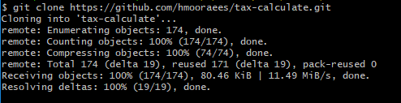

# Documentação do Projeto

## Pré Requisitos do Projeto

- Java 17
- Maven

## Framework e Bibliotecas Utilizadas

- Spring Boot
- JPA
- Lombok
- Mapstruct
- H2
- JUnit 5
- Mockito

### Observações:

- Utilização da biblioteca Lombok para otimizar as classes utilizando anotações e ajudar na criação de seus métodos de acesso, facilitando no build do DTOs e entidades. Também utilizado para facilitar na observabilidade.
- Utilização da biblioteca Mapstruct para consersão e mapeamento entre os DTOs e entre as entidades.
- Utilização do banco de dados H2 para criação do modelo de entidades.
- Utilização do JUnit 5 e Mockito para criação de testes unitários e integrados.

## Detalhes da Solução

#### O projeto principal foi modularizado em sub projetos. Cada sub modulo possui suas depenências necessárias e as dependências do projeto principal.
- Módulo **application**: Possui a classe principal de execução do projeto e as classes de configuração dos **beans** iniciais (não foi necessário nesse caso). Também possui os controles de entrada para aplicação (os endponits) onde centraliza todas as chamadas externas.
- Módulo **database**: Responsável pela gerenciamento, comunicação e iteração com o banco de dados.
- Módulo **entity**: Centraliza todas as endidades da aplicação.
- Módulo **port**: Possui todas as portas de entrada e saída da aplicação para a camada de negócio, tanto dos controllers como do database.
- Módulo **presenter**: Camada de negócio para apresentar para o solicitante o que foi solicitado.
- Módulo **usecase**: Camada de negócio para tratar as regras do que foi solicitado e dar andamento interno na solicitação.

Observações: Os impostos por cada tipo de categoria está mapeado dentro da aplicação. Essa solução foi tomada para facilitar no cálculo no momento da execução. Uma segunda opção avaliada seria criar no modelo de banco de dados de categoria para facilitar a manutenção. 

### Detalhes para Chamada do Endpoint

- Foi utilizado a aplicação Postman para realizar a chamada:

``URL:`` ``[POST] http://localhost:8887/v1/api/products``

``Headers:`` ``Content-Type: application/json``

``Body:`` ``{ "name": "string", "category": "string", "basePrice": "double" }``

- Exemplo:

## Requisitos para Execução

- Ter o Git instalado, caso não tenha utilize este <a href="https://git-scm.com/downloads" download>link</a>
- Ter uma IDE instalada, para este exemplo iremos utilizar o IntelliJ IDEA Community Edition, caso não tenha pode baixar no <a href="https://www.jetbrains.com/idea/download/#section=windows">link</a>

### Passo a Passo Para Exacução

1. Realize o clone do projeto através do comando

``git clone https://github.com/hmooraees/tax-calculate.git``

2. Como pode ver ele irá realizar o download corretamente na branch **main**

3. Abra o IntelliJ IDEA Community Edition e selecione o botão **Open**

4. Ache nas suas pastas o projeto que acabou de clonar e abra ele

5. Ache a classe de inicialização conforme demonstrado e clique no botão verde de **Play**

6. Este projeto utiliza Lombok, caso aparece uma janela pedindo para habilitar, clique em **Sim**

7. O projeto deve subir sem nenhum problema

